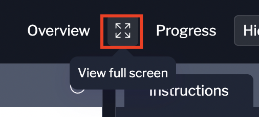

Before getting started, if you are on a small screen, try using the full screen mode with the button above.



---

The Acme Analytics API is live. Your environment has `curl`, `jq`, and Python 3 pre-installed. The `$ACME_API` environment variable points to the API base URL.

Open the API Docs tab to browse the full endpoint reference — then follow the steps below.

---

## Step 1: Verify Connectivity

Start by confirming your environment variable is set:

```bash,run
echo $ACME_API
```

You should see `http://api:8000`. Now call the health endpoint to confirm the API is up and the database is loaded:

```bash,run
curl -s $ACME_API/api/health | jq .
```

You should see a JSON response with `"status": "ok"` and a `customers_loaded` count. That's your live PostgreSQL database.

---

## Step 2: List and Filter Customers

Get all customers:

```bash,run
curl -s $ACME_API/api/customers | jq .
```

The response includes a `count` field and the full customer list. Now filter by segment to see only enterprise accounts:

```bash,run
curl -s "$ACME_API/api/customers?segment=enterprise" | jq '.customers[] | {name, company, status}'
```

Retrieve a single customer by ID:

```bash,run
curl -s $ACME_API/api/customers/1 | jq .
```

Try a few different IDs. Notice the `member_since` field — this is customer tenure derived from the `created_at` timestamp in the database.

Now filter for at-risk accounts — these are the customers your platform flags for follow-up:

```bash,run
curl -s "$ACME_API/api/customers?status=at-risk" | jq '.customers[] | {name, company, segment}'
```

---

## Step 3: Explore the Analytics Endpoints

Pull the revenue breakdown by segment:

```bash,run
curl -s $ACME_API/api/analytics/revenue | jq .
```

Look at the `by_segment` array. Notice how revenue concentrates in enterprise. The `avg_order_value` tells you what a typical transaction looks like per tier.

Check the churn-risk accounts:

```bash,run
curl -s $ACME_API/api/analytics/churn-risk | jq '.accounts[] | {name, company, segment, days_inactive, risk_level}'
```

These are accounts the platform has automatically surfaced as needing attention — either flagged by status or inactive for 90+ days.

You can also explore these endpoints interactively in the API Docs tab.

---

## Step 4: Register a New Customer

Use `POST /api/customers` to register a customer. Replace the example values with any name and email you like — just make sure the email is unique:

```bash,run
curl -s -X POST $ACME_API/api/customers \
  -H "Content-Type: application/json" \
  -d '{
    "name": "Alex Rivera",
    "email": "alex@mycompany.com",
    "company": "MyCompany",
    "segment": "startup"
  }' \
  -o /tmp/response.json -w "Status: %{http_code}\n" ; jq . /tmp/response.json
```

You should see `Status: 201` — the HTTP status code confirming the resource was created — followed by the new customer record with its assigned `id`. Verify the customer was persisted by fetching it:

```bash,run
curl -s "$ACME_API/api/customers?status=active" | jq '.customers[-1]'
```

Your new customer should appear in the list with `"status": "active"`.

<instruqt-task id="register_customer">
  Register a new customer via `POST $ACME_API/api/customers`.
</instruqt-task>

✅ You've made your first successful API calls against a live PostgreSQL-backed REST API. Move on to the next chapter to build a real integration.
